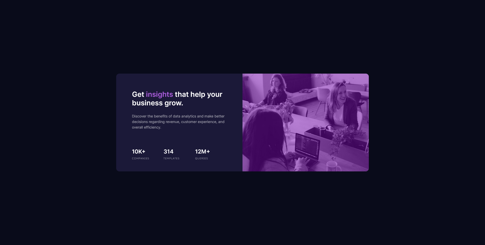
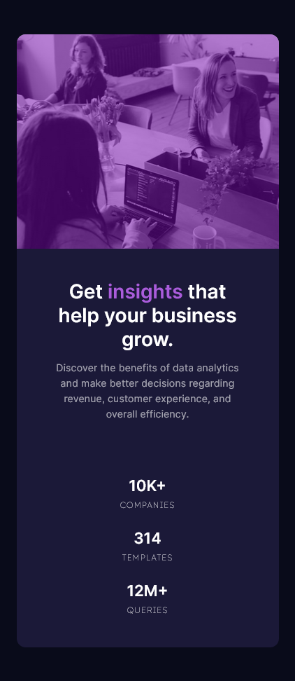

# Frontend Mentor - Stats preview card component solution

This is a solution to the [Stats preview card component challenge on Frontend Mentor](https://www.frontendmentor.io/challenges/stats-preview-card-component-8JqbgoU62). Frontend Mentor challenges help you improve your coding skills by building realistic projects. 

## Table of contents

- [Overview](#overview)
  - [The challenge](#the-challenge)
  - [Screenshot](#screenshot)
  - [Links](#links)
- [My process](#my-process)
  - [Built with](#built-with)
  - [What I learned](#what-i-learned)
  - [Continued development](#continued-development)
  - [Useful resources](#useful-resources)
- [Author](#author)


## Overview

### The challenge

Users should be able to:

- View the optimal layout depending on their device's screen size

### Screenshot





### Links

- Live Site URL: [Add live site URL here](https://your-live-site-url.com)

## My process

### Built with

- Semantic HTML5 markup
- Sass
- Flexbox
- Mobile-first workflow

### What I learned

To build this project I basically used Sass, if someone read this who has no idea what Sass mean, it is nothing , just like regular css but added  some extra features that you can use without worry too much, such as nested css selectors. And also for class names I use BEM model, which stand for Block, Element, Modifier. This class name model comes in handy especially when you use Sass.

By looking at following HTML code snippet you will able to see how BEM model appiled for naming class names 

```html
   <!-- status  -->
        <ul class="main-cont__desc-status">
          <li class="main-cont__desc-status-li">
            <span class="main-cont__desc-status-li-val">10k+</span> 
            <span class="main-cont__desc-status-li-label">companies</span>
          </li>
          <li class="main-cont__desc-status-li">
            <span class="main-cont__desc-status-li-val">314</span> 
            <span class="main-cont__desc-status-li-label">templates</span>
          </li>
          <li class="main-cont__desc-status-li">
            <span class="main-cont__desc-status-li-val">12m+</span> 
            <span class="main-cont__desc-status-li-label">queries</span>
          </li>
        </ul>
```

And also look carefully how BEM model help in Sass, It gives well organized selector names.
```scss
    // status part styling
    &-status {
      height: 180px;
      list-style: none;
      display: flex;
      flex-direction: column;
      align-items: center;
      justify-content: space-around;
      &-li {
        flex: 1;
        display: flex;
        flex-direction: column;
        justify-content: center;
        align-items: center;
        &-val {
          font-family: util.$font_1;
          font-size: 1.1rem;
          text-transform: uppercase;
          font-weight: 600;
          color: var(--White);
        }
        &-label {
          font-family: util.$font_2;
          text-transform: uppercase;
          font-size: 0.59rem;
          color: var(--White);
          font-weight: 200;
          letter-spacing: 1px;
          margin-top: 5px;
        }
      }

      @media (min-width: 612px) {
        height: 20%;
        width: 75%;
        flex-direction: row;
        margin-bottom: 20px;
        &-li {
          display: block;
          white-space: pre-line;
          &-val {
            font-size: 1.1rem;
        
          }
          &-label {
        
            font-size: 0.5rem;
            font-weight: 100;
          }
        }
      }
    }
```


### Continued development

I hope to add this some functionality using javascript, then values can change values dynamically.


### Useful resources

- [freecodecamp](https://www.freecodecamp.org/news/css-properties-examples/) - This article helped me to clarify some doubts about min-width, max-width in css.
- [chatGPT](https://chat.openai.com) - I used this A.I. tool to clear some doubts about css.

## Author

- Frontend Mentor - [iamdylanmj](https://www.frontendmentor.io/profile/iamdylanmj)
- Twitter - [DylanM](https://twitter.com/DilanMa98729384)

